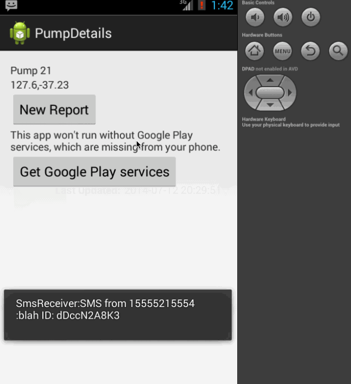
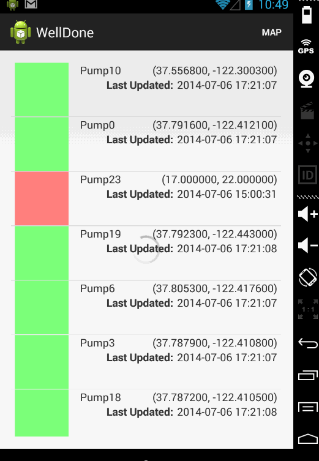

#### WellDone

Notifications:

* Example of what a json Parse push notification looks like:
..* {"title": "Pump 16 Broken", "alert": "37.7858, -122.4079", "action":
"PUMP_ALERT", "pump_name": "Pump 16", "location": "37.7858,
-122.4079", "objectId": "dDccN2A8K3"}
* Example of what an SMS notification looks like:
..* Broken: Pump 16. Location: 37.7858, -122.4079. ID: dDccN2A8K3
* The important part of each notification is the objectId/ID
  field. This is what is used to identify a particular Parse object.

- Initial commit added: downloads some dummy [Pump data from Parse](https://www.parse.com/apps/welldone--4/collections) and displays in a listview.

